# CUBE

The goal of my portfolio project is to spread knowledge about NFTs. To teach anybody from novice or advanced beginner how to buy or sell an NFT. It's something I've been really interested in in recent years. 

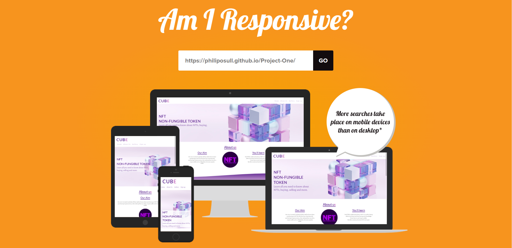

[Live website](https://philiposull.github.io/Project-One/)

## Project Goals

### Users Goals

- Learn how to Buy & sell NFTs
- Find a website that does this with easy to follow steps
- Who are the top NFT projects

### My Goals

- Spread knowledge about NFTs to new users 
- Catch the users attention with a nice UI & UX
- Build a community of like-minded individuals

## Technologies

### Languages

1. HTML
2. CSS

### Frameworks & Tools

- Git
- Github
- Gitpod
- Google Fonts
- Opensea.io
- Soft.io
- Shutterstock
- Istockphoto
- Unsplash.com
- W3schools
- PhotoScissors.com
- HTML-color-codes.info/colors-from-image/

## Features

### Favicon

- This Site features a favicon of the cube in the hero image reduced in size.

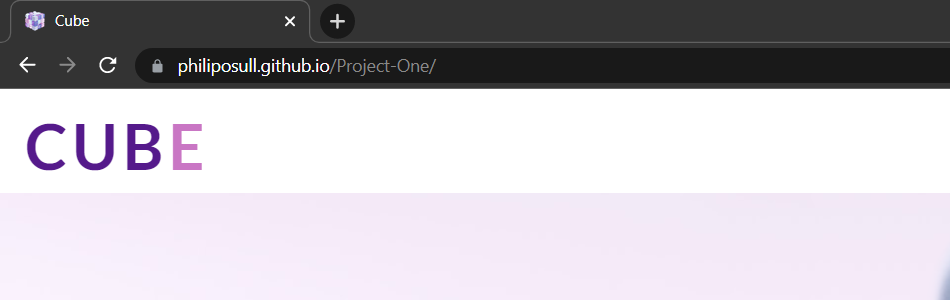

### Home

- The home section features a responsive navigation bar and a hero image. The text to the left of the hero image informs the user straight away what the site is intended for. Once I put background-size: cover on the original photo so that on screen sizes such as 5000px the image would look perfect the background image was then too centered, there was too much empty space to the right hand side which didn't look good. With that in mind the original photo was edited using [PhotoScissors](https://photoscissors.com/) so that the cube would sit to the right of the screen and the text would be on the left. The original photo itself is then used on the smaller 480px screens so that the cube is more centered and can be seen on all screen sizes. 

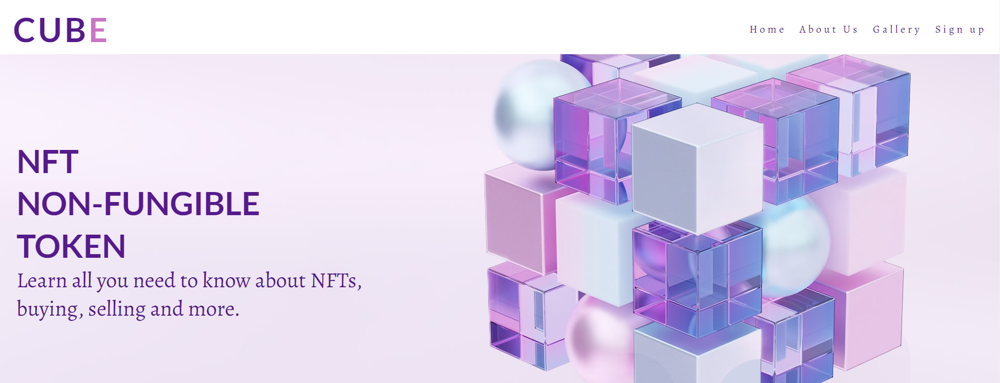

### About Us

- The About page features an eye catching logo in the center, with a complimenting color to the rest of the site, image was taken from [IstockPhoto](https://www.istockphoto.com/) To the left of the logo is Our Aim, letting the user know what we aim to do. To the right of the logo it informs the user what they will learn from signing up to the website. The About section uses flex, this made it a very easy and smooth experience when reducing the screen size for smaller devices, it looks just as good on all screens. At the very bottom there is an SVG wave, sticking with the same color palette as the website and making a nice flow into the Gallery section.

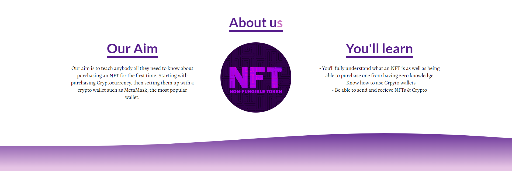

### Gallery

- The Gallery section uses the same color as the botoom of the SVG wave, using [HTML-color-codes](https://html-color-codes.info/colors-from-image/) to get the exact color from the SVG image, so they flow nicely into eachother. The Gallery consists of some of the top NFT projects to date. These are the most popular amongst the NFT community and some of the most expensive to aquire. Like the About section the Gallery section also uses flex, it reduces the images very smoothly on smaller screens and looks just as pleasing to the eye.

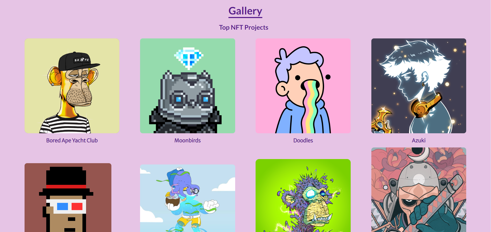

### Sign-up Form

- The Sign-up Form section has a dismanteled cube background image which I really liked the look of and the colors compliment the sites color palette, the image was taken from [ShutterShock](https://www.shutterstock.com/). The form was used from the challenge 1 & 2 I did for the [Love Running](https://code-institute-org.github.io/love-running-2.0/index.html) project, I removed code I didn't want to use for mine and altered code to better suit my site.

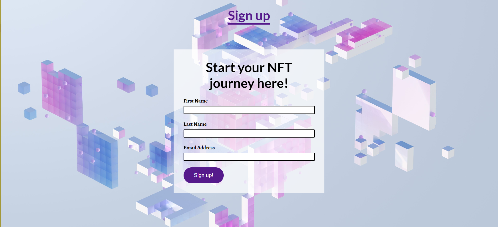

### Footer

- The Footer section has the same color as the main headings on the page aswell as the sign-up button on the form, so that they all compliment eachother very well. The footer has copyright info that protects business copyright. It also has social media links and icons with links, as the screen size reduces for smaller devices only the icons are shown so its important they also bring the user to the social media site when clicked.

### 404 error

- The 404 error page consists of my hero image cube but in black and white along with the text "404, Page not found, Please click `here` to go back to CUBE". The `here` is a link back to my project website. I created this 404.html and the CSS code in a serparate GitPod because I couldn't figure out how to preview it in my current project. Later I found out I could install an extension called "Live Server" and that would let me preview the 404.html.

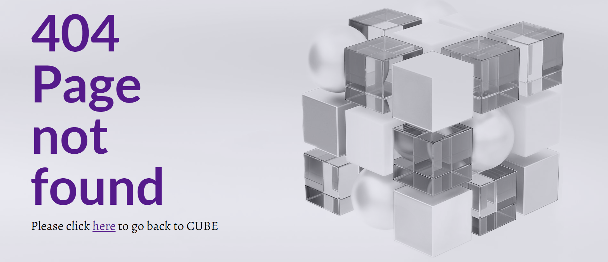

### Features to Implement in the Future

In the future, I would like to add more pages to the website. I would also like to add the 'smooth-scrolling' feature and make the Gallery a slideshow feature which I think would add a little extra to the website. 

## Testing

### HTML Validation
---

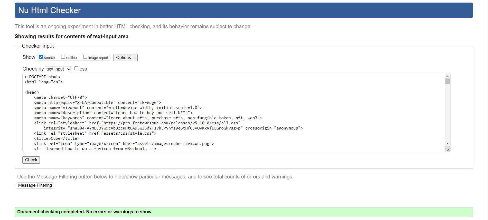

- The W3C Markup Validation Service was used and passed with no errors.

### CSS Validation
---

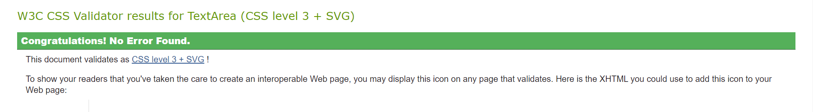

- The W3C Jigsaw CSS Validation Service was used and passed with no errors.

### Accessibility
---

The WAVE WebAIM web accessibility evaluation tool was used so that the website was up to high accessibility standards. No errors were detected. It had 1 alert which said the "CUBE" logo and "Home" in the navigation bar had the same link.

### Functionality
---

| **Feature** | **Action** | **Expected Outcome** | **Actual Outcome** |
|-------------|------------|---------------------|-------------------|
| Navigation | Press each Navigation link | Each Navigation link went to the correct place | PASS |
| Sign-up Form | Leave first name or last name blank | Form says "Please fill in this field" | PASS |
| Sign-up Form | Leave out '@' when putting in an email address | Form says "Please inlcude an '@' in the email address" | PASS |
| Sign-up Form | Fill in all details and press 'Sign-up' | Sends data to formdump website when submitted and shows all the key value pairs as expected | PASS |
| Sign-up Button | Move cursor over button | Gives a nice little effect | PASS | 
| Footer Links | Click each social media link | Each social media site should open up in a new tab | PASS |

## Performance
---

### Desktop

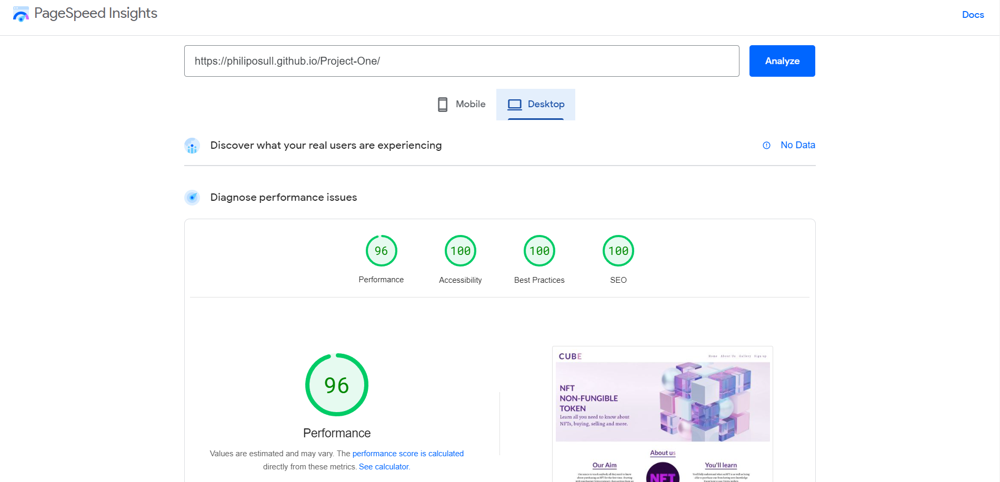

- [PageSpeed Insights](https://pagespeed.web.dev/) was used to test the performance of the website for Desktop

### Mobile

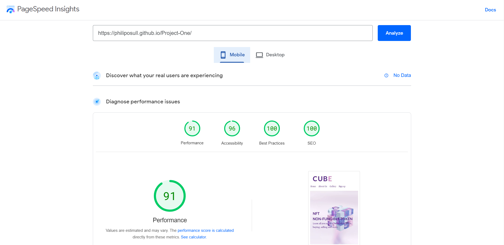

- [PageSpeed Insights](https://pagespeed.web.dev/) was used to test the performance of the website for Mobile.

### Compatibility with browsers

The website was tested on these broswers:

- Google Chrome
- Brave
- Microsoft Edge
- Mozilla Firefox

### Performing tests on devices

The project website was tested on these devices:

- Acer TravelMate | P
- Samsung S10+

### Performing tests on different screen-sizes

The project website was tested on numerous screen-sizes:

- From 280px to 5000px

## Bugs

| **Bug** | **Fix** |
| ----------- | ----------- |
| The cube on the hero image goes off screen on smaller screens | Add a second image where the cube is centered for smaller screens |  
| About section logo moves to the right on smaller screens | Remove margin left/right and use `text-align: center` |
| Gallery section wouldn't re-size properly on smaller screens | Used the flex property for a smoother experience |

## Unsolved issues

- I tried to include 'Smooth scrolling', but when I clicked any of the navigation links only sometimes it would go to the section perfectly,  other times it would go half way or not at all. This is something I will look into further for future projects.  
 
## Deployment

The website development was created in the "main" branch. This branch was deployed using GitHub Pages.

- This site was deployed by completing the following steps:

1. Open GitHub.
2. Click on the project to be deployed.
3. Navigate to the "Settings".
4. Navigate down to the "GitHub Pages".
5. Click on "Check it out here!".
6. Select the "main" branch and select "Save".
7. The link to the live website was ready on the top.

## Cloning

- Clone this project following the steps:

1. Open GitHub.
2. Click on the project to be cloned.
3. You will be provided with three options to choose from, HTTPS, SSH or GitHub CLI, click the clipboard icon in order to copy the URL.
4. Open a new terminal.
5. Change the current working directory to the location that you want the cloned directory.
6. Type 'git clone' and paste the URL copied in step 3.
7. Press 'Enter' and the project is cloned.

## Forking

1. Open GitHub.
2. Click on the project to be forked.
3. Click on Fork button in the upper right hand corner.
4. Clone the fork of your repo, so you can edit the contents locally.
5. Make edits to your local cloned copy of the repo on your computer.
6. `git` `add`, `commit` and `push` those edits back to your fork on GitHub.
7. Suggest the changes that you made, to be added to Project repo using a pull request.

- General note: Any push to the main branch automatically updates the live site.

## Credits

### Content

The content in the "About us" section was written by me.

### Media

The Hero image was taken from [Unsplash](https://unsplash.com/)

The About section logo was taken from [IStockPhoto](https://www.istockphoto.com/)

The Gallery NFTs were taken from [OpenSea](https://opensea.io/)

The Sign-up Background image was taken from [ShutterShock](https://www.shutterstock.com/)

## Acknowledgements

I would like to take the opportunity to thank:

- My mentor Brian Macharia

- A passed student Feddie Dermesonoglou

- To all the lovely people from Code Institute and on Slack 